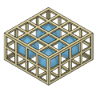
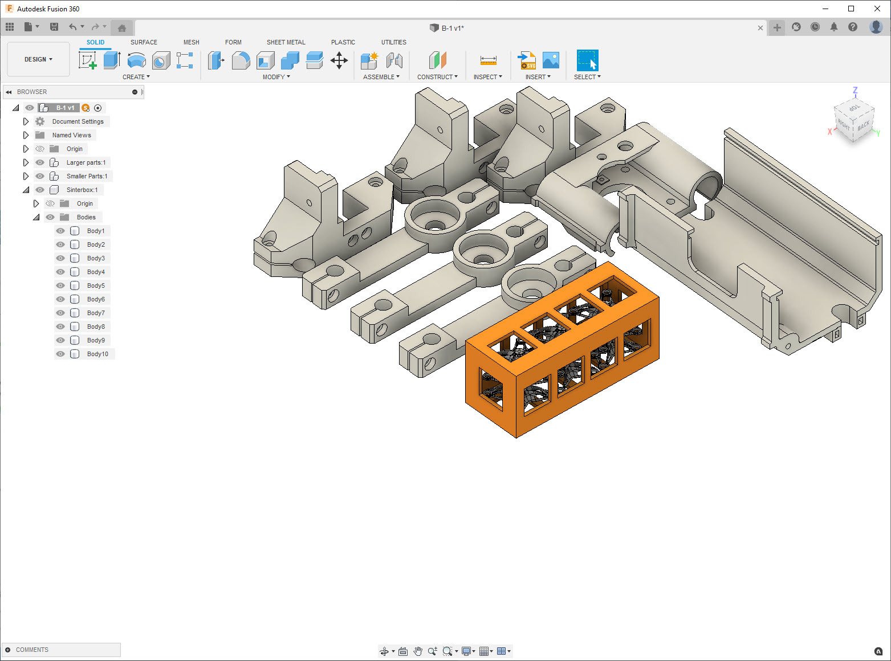
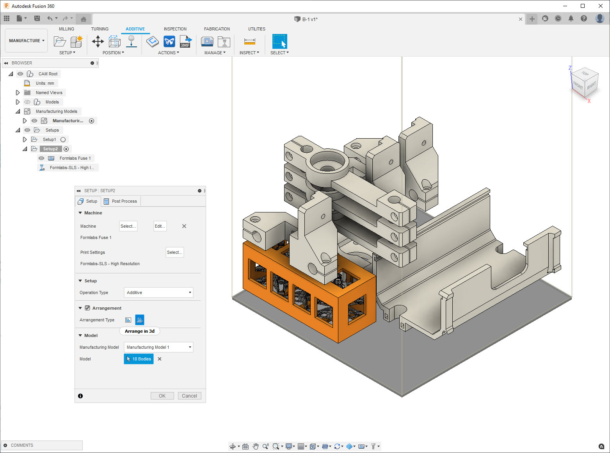
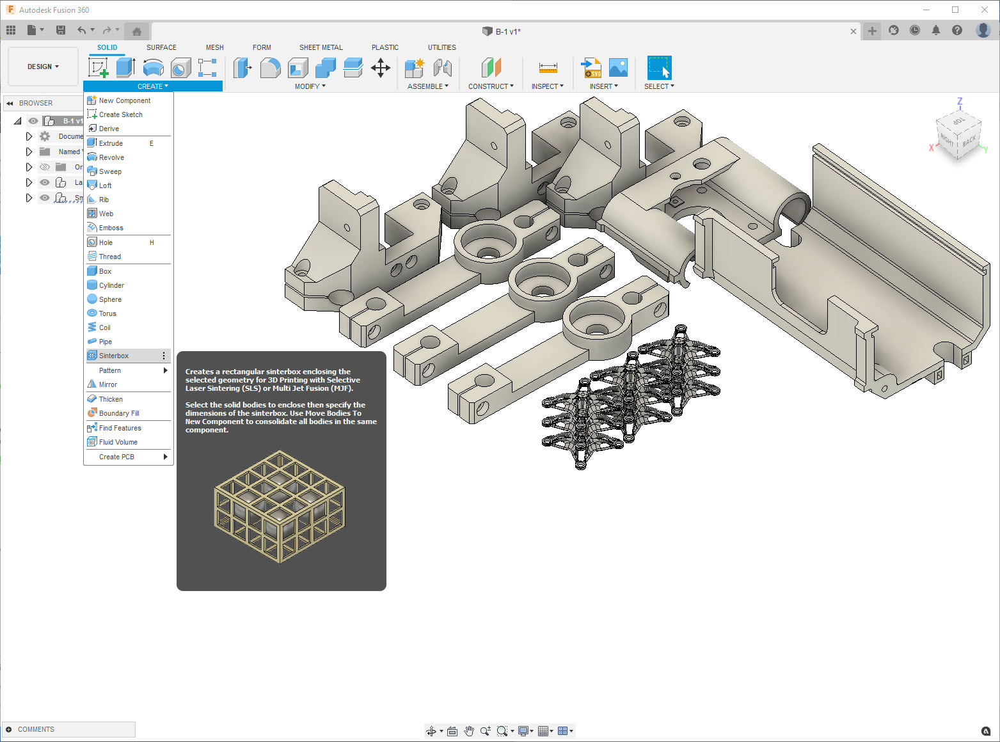
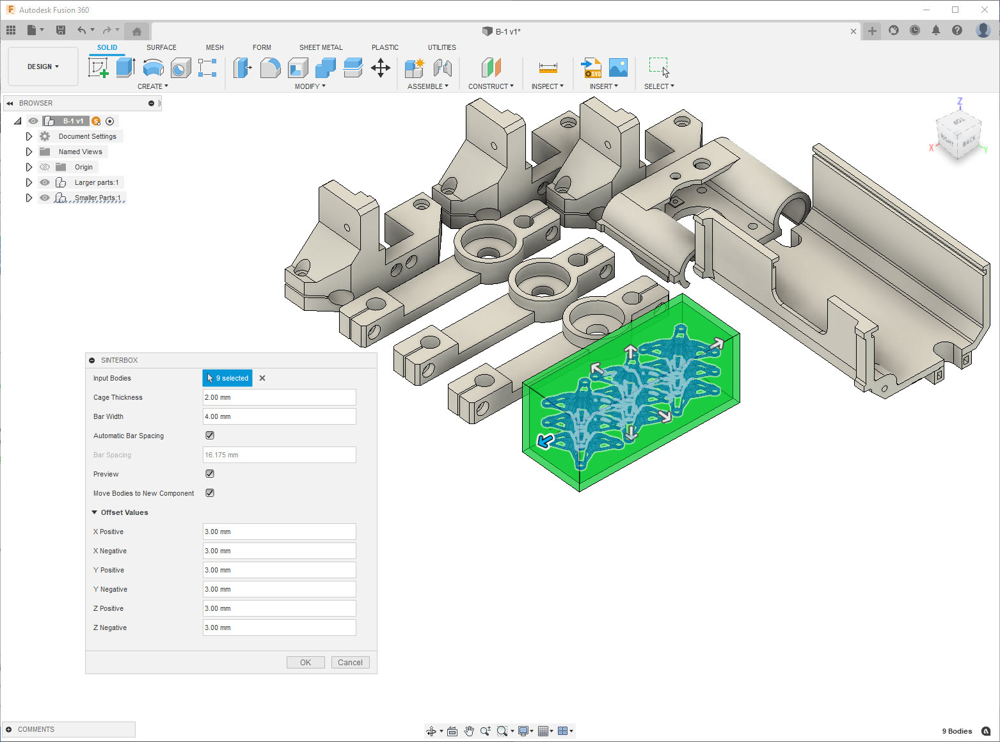

SinterBox
=========

Fusion 360 Addin to create sinter box geometry for Additive Manufacturing

Description
-----------

In Additive manufacturing with powder based plastic 3D printers (SLS and/or MJF) it is common practice to utilize a sinterbox in order to protect small & fragile parts so that they do not get lost or damaged during the post-processing phase.

Using this add-in, you can quickly create a rectangular sinterbox enclosing multiple solid bodies. During the creation process, you edit key sinterbox dimensions such as case thickness, bar width and bar spacing, as well as the offset between selected parts and the sinterbox itself.

The add-in also provides the option to move the input bodies from their original component to the newly created component named Sinterbox. The main benefit of this option can be realized when 3D Packing parts in the Manufacture workspace for an Additive setup with an SLS / MFJ 3D printer, as the 3D arrangement algorithm keeps a multi body component together when placing them in the build volume.

Usage
-----

After you are finished with your design, using Move/Copy, Align or Arrange commands, rearrange the small parts you wish to create a sinterbox around so that they are close to each other.

Activate the Sinterbox feature within the DESIGN workspace, SOLID Tab, CREATE Panel. Select one or more Solid bodies as input geometry for the creation of the sinterbox.

The Cage Thickness and Bar Width fields have a default value of 2 mm and 4 mm respectively but can be edited manually.

The Bar Spacing value will be automatically calculated and will update every time you select a new solid body intelligently based on the smallest part selected.

You can uncheck the Automatic Bar Spacing checkbox and enter a manual value for Bar Spacing if desired. Upon selecting the first input body, you will get an in-canvas preview of the sinterbox with all the bars while the Preview checkbox is checked.

If you uncheck the Preview checkbox, the sinterbox preview will not display the bars.

The offset values have a default value of 3 mm, which controls the gap between the outbox of the selected geometry and the sinterbox in all 6 directions (+/- X,Y,Z). You can edit the Offset Values to any positive value.

When checked, the Move Bodies to New Component checkbox removes the input bodies from their original component and includes them in the new component created by this feature.

Upon clicking OK you will get a new component in the BROWSER named Sinterbox with one or more bodies depending on whether or not you checked the Move Bodies to New Component.

Installation
------------

Download installers from the `Autodesk App Store <https://apps.autodesk.com/FUSION/en/Detail/Index?id=5411868152730894585&appLang=en&os=Win64>`_

To run directly from source simply clone this repo to your Fusion 360 add-ins folder.

License
-------
`MIT License`_

.. _MIT License: ./LICENSE

Authors
-------

**SinterBox** was written by `Patrick Rainsberry <patrick.rainsberry@autodesk.com>`_.
